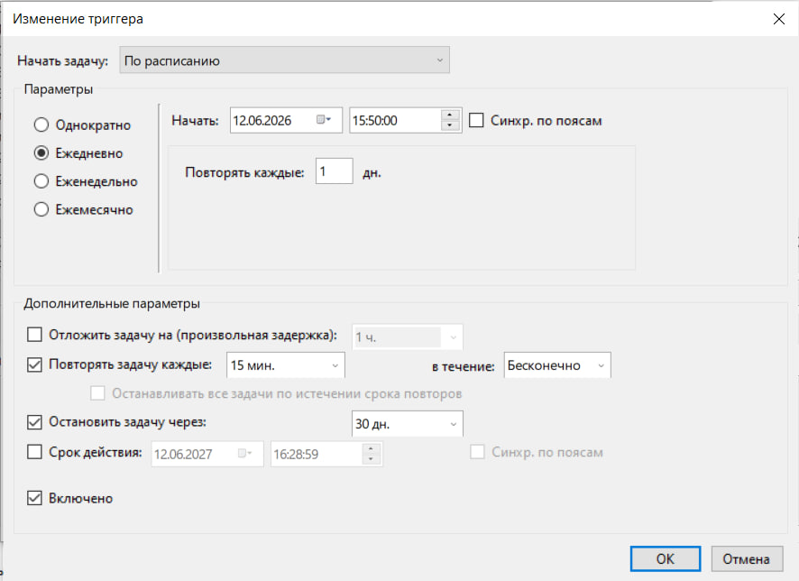
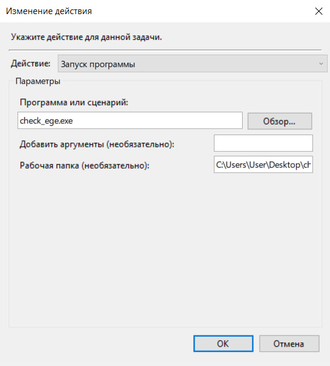
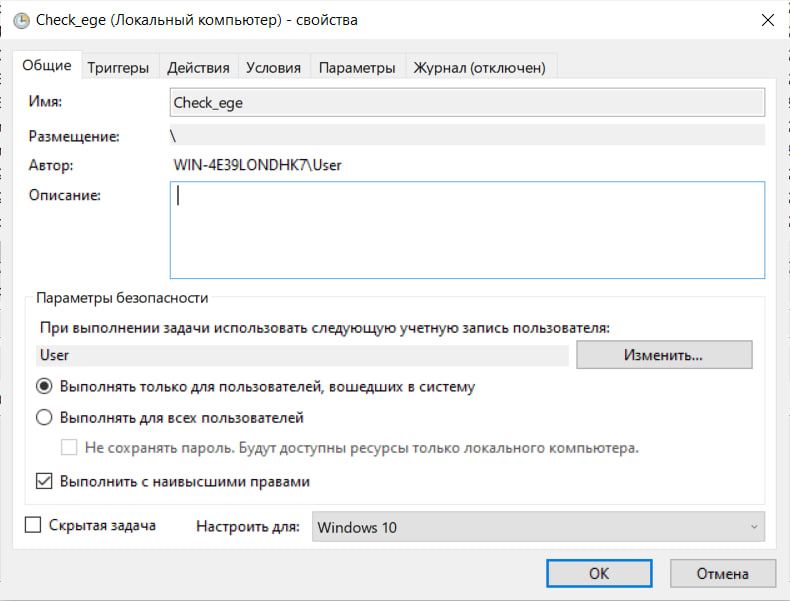

# Check EGE

Программа автоматически проверяет появление результатов ЕГЭ на сайте РЦОИ Республики Башкортостан и отправляет уведомления по электронной почте.

Баллы не отправляются в уведомлениях — только информация о появлении нового результата или изменении статуса экзамена.

Возможности:

- Автоматический вход в личный кабинет РЦОИ
- Уведомления по электронной почте
- Отслеживание новых результатов
- Отслеживание изменения статуса экзамена
- Баллы не отображаются в уведомлениях

## Настройка:

Заполните файл "config.json" своими данными.

| Параметр | Описание |
|-----------|-----------|
| family | Фамилия участника |
| name | Имя участника |
| father | Отчество участника |
| number | Последние 6 цифр паспорта |
| smtp_server | SMTP-сервер почты |
| smtp_login | Логин почты |
| smtp_password | Пароль приложения |
| recipient_email | Почта для получения уведомлений |

Для отправки уведомлений используется SMTP-сервер.

Для большинства почтовых сервисов требуется пароль приложения, а не обычный пароль аккаунта.

Вот несколько ссылок для получения пароля

|Сервис| SMTP-сервер| Получение пароля приложения|
|------|------------|----------------------------|
|Mail.ru| "smtp.mail.ru"| https://account.mail.ru/user/2-step-auth/passwords|
|Gmail| "smtp.gmail.com"| https://myaccount.google.com/apppasswords|
|Яндекс Почта| "smtp.yandex.ru"| https://id.yandex.ru/security/app-passwords|
|Outlook / Hotmail| "smtp.office365.com"| https://account.live.com/proofs/manage|
|Yahoo Mail| "smtp.mail.yahoo.com"| https://login.yahoo.com/account/security|

## Сборка

`cargo build --release`

Готовый файл:

`target/release/check_ege.exe`

Первый запуск

При первом запуске программа сохраняет текущее состояние результатов и отправляет тестовое письмо. Это сделано для того, чтобы уведомления приходили только о новых результатах.

## Планировщик Windows

Рекомендуется запускать программу через Планировщик заданий Windows.

Чтобы открыть Планировщик заданий, нажмите "Win + R" и введите: `taskschd.msc`

Настройка приведена на скриншотах ниже.

## Настройка триггера

## Настройка действия

## Настройка общих параметров
